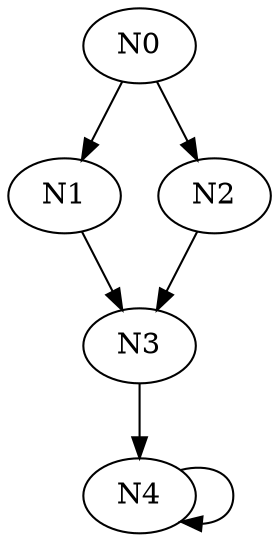
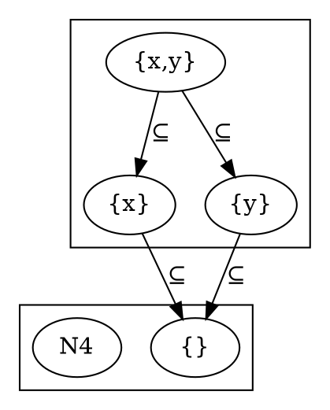

Generate files suitable for use with [Graphviz](https://www.graphviz.org/)

The `render` function generates output (e.g., an `output.dot` file) for
use with [Graphviz](https://www.graphviz.org/) by walking a labeled
graph. (Graphviz can then automatically lay out the nodes and edges
of the graph, and also optionally render the graph as an image or
other [output formats](
https://www.graphviz.org/content/output-formats), such as SVG.)

Rather than impose some particular graph data structure on clients,
this library exposes two traits that clients can implement on their
own structs before handing them over to the rendering function.

Note: This library does not yet provide access to the full
expressiveness of the [DOT language](
https://www.graphviz.org/doc/info/lang.html). For example, there are
many [attributes](https://www.graphviz.org/content/attrs) related to
providing layout hints (e.g., left-to-right versus top-down, which
algorithm to use, etc). The current intention of this library is to
emit a human-readable .dot file with very regular structure suitable
for easy post-processing.

# Examples

The first example uses a very simple graph representation: a list of
pairs of ints, representing the edges (the node set is implicit).
Each node label is derived directly from the int representing the node,
while the edge labels are all empty strings.

This example also illustrates how to use `Cow<[T]>` to return
an owned vector or a borrowed slice as appropriate: we construct the
node vector from scratch, but borrow the edge list (rather than
constructing a copy of all the edges from scratch).

The output from this example renders five nodes, with the first four
forming a diamond-shaped acyclic graph and then pointing to the fifth
which is cyclic.

```rust
type Nd = isize;
type Ed = (isize,isize);
struct Edges(Vec<Ed>);

pub fn render_to<W: std::io::Write>(output: &mut W) {
    let edges = Edges(vec![(0,1), (0,2), (1,3), (2,3), (3,4), (4,4)]);
    dot2::render(&edges, output).unwrap()
}

impl<'a> dot2::Labeller<'a> for Edges {
    type Node = Nd;
    type Edge = Ed;
    type Subgraph = ();

    fn graph_id(&'a self) -> dot2::Id<'a> {
        dot2::Id::new("example1").unwrap()
    }

    fn node_id(&'a self, n: &Nd) -> dot2::Id<'a> {
        dot2::Id::new(format!("N{}", *n)).unwrap()
    }
}

impl<'a> dot2::GraphWalk<'a> for Edges {
    type Node = Nd;
    type Edge = Ed;
    type Subgraph = ();

    fn nodes(&self) -> dot2::Nodes<'a,Nd> {
        // (assumes that |N| \approxeq |E|)
        let &Edges(ref v) = self;
        let mut nodes = Vec::with_capacity(v.len());

        for &(s,t) in v {
            nodes.push(s); nodes.push(t);
        }

        nodes.sort();
        nodes.dedup();
        nodes.into()
    }

    fn edges(&'a self) -> dot2::Edges<'a,Ed> {
        let &Edges(ref edges) = self;
        (&edges[..]).into()
    }

    fn source(&self, e: &Ed) -> Nd {
        let &(s,_) = e;

        s
    }

    fn target(&self, e: &Ed) -> Nd {
        let &(_,t) = e;

        t
    }
}

# pub fn main() { render_to(&mut Vec::new()) }
```

```no_run
# pub fn render_to<W:std::io::Write>(output: &mut W) { unimplemented!() }
pub fn main() {
    let mut f = std::fs::File::create("example1.dot2").unwrap();
    render_to(&mut f)
}
```

Output from first example (in `example1.dot2`):



The second example illustrates using `node_label` and `edge_label` to
add labels to the nodes and edges in the rendered graph. The graph
here carries both `nodes` (the label text to use for rendering a
particular node), and `edges` (again a list of `(source,target)`
indices).

This example also illustrates how to use a type (in this case the edge
type) that shares substructure with the graph: the edge type here is a
direct reference to the `(source,target)` pair stored in the graph's
internal vector (rather than passing around a copy of the pair
itself). Note that this implies that `fn edges(&'a self)` must
construct a fresh `Vec<&'a (usize,usize)>` from the `Vec<(usize,usize)>`
edges stored in `self`.

Since both the set of nodes and the set of edges are always
constructed from scratch via iterators, we use the `collect()` method
from the `Iterator` trait to collect the nodes and edges into freshly
constructed growable `Vec` values (rather than using `Cow` as in the
first example above).

The output from this example renders four nodes that make up the
Hasse-diagram for the subsets of the set `{x, y}`. Each edge is
labeled with the &sube; character (specified using the HTML character
entity `&sube`).

```rust
type Nd = usize;
type Ed<'a> = &'a (usize, usize);

struct Graph {
    nodes: Vec<&'static str>,
    edges: Vec<(usize,usize)>,
}

pub fn render_to<W: std::io::Write>(output: &mut W) {
    let nodes = vec!["{x,y}","{x}","{y}","{}"];
    let edges = vec![(0,1), (0,2), (1,3), (2,3)];
    let graph = Graph { nodes: nodes, edges: edges };

    dot2::render(&graph, output).unwrap()
}

impl<'a> dot2::Labeller<'a> for Graph {
    type Node = Nd;
    type Edge = Ed<'a>;
    type Subgraph = ();

    fn graph_id(&'a self) -> dot2::Id<'a> {
        dot2::Id::new("example2").unwrap()
    }

    fn node_id(&'a self, n: &Nd) -> dot2::Id<'a> {
        dot2::Id::new(format!("N{}", n)).unwrap()
    }

    fn node_label<'b>(&'b self, n: &Nd) -> dot2::label::Text<'b> {
        dot2::label::Text::LabelStr(self.nodes[*n].into())
    }

    fn edge_label<'b>(&'b self, _: &Ed) -> dot2::label::Text<'b> {
        dot2::label::Text::LabelStr("&sube;".into())
    }
}

impl<'a> dot2::GraphWalk<'a> for Graph {
    type Node = Nd;
    type Edge = Ed<'a>;
    type Subgraph = ();

    fn nodes(&self) -> dot2::Nodes<'a,Nd> {
        (0..self.nodes.len()).collect()
    }

    fn edges(&'a self) -> dot2::Edges<'a,Ed<'a>> {
        self.edges.iter().collect()
    }

    fn source(&self, e: &Ed) -> Nd {
        let & &(s,_) = e;

        s
    }

    fn target(&self, e: &Ed) -> Nd {
        let & &(_,t) = e;

        t
    }
}

# pub fn main() { render_to(&mut Vec::new()) }
```

```no_run
# pub fn render_to<W:std::io::Write>(output: &mut W) { unimplemented!() }
pub fn main() {
    let mut f = std::fs::File::create("example2.dot").unwrap();
    render_to(&mut f)
}
```

The third example is similar to the second, except now each node and
edge now carries a reference to the string label for each node as well
as that node's index. (This is another illustration of how to share
structure with the graph itself, and why one might want to do so.)

The output from this example is the same as the second example: the
Hasse-diagram for the subsets of the set `{x, y}`.

```rust
type Nd<'a> = (usize, &'a str);
type Ed<'a> = (Nd<'a>, Nd<'a>);

struct Graph {
    nodes: Vec<&'static str>,
    edges: Vec<(usize,usize)>,
}

pub fn render_to<W: std::io::Write>(output: &mut W) {
    let nodes = vec!["{x,y}","{x}","{y}","{}"];
    let edges = vec![(0,1), (0,2), (1,3), (2,3)];
    let graph = Graph { nodes: nodes, edges: edges };

    dot2::render(&graph, output).unwrap()
}

impl<'a> dot2::Labeller<'a> for Graph {
    type Node = Nd<'a>;
    type Edge = Ed<'a>;
    type Subgraph = ();

    fn graph_id(&'a self) -> dot2::Id<'a> {
        dot2::Id::new("example3").unwrap()
    }

    fn node_id(&'a self, n: &Nd<'a>) -> dot2::Id<'a> {
        dot2::Id::new(format!("N{}", n.0)).unwrap()
    }

    fn node_label<'b>(&'b self, n: &Nd<'b>) -> dot2::label::Text<'b> {
        let &(i, _) = n;

        dot2::label::Text::LabelStr(self.nodes[i].into())
    }

    fn edge_label<'b>(&'b self, _: &Ed<'b>) -> dot2::label::Text<'b> {
        dot2::label::Text::LabelStr("&sube;".into())
    }
}

impl<'a> dot2::GraphWalk<'a> for Graph {
    type Node = Nd<'a>;
    type Edge = Ed<'a>;
    type Subgraph = ();

    fn nodes(&'a self) -> dot2::Nodes<'a,Nd<'a>> {
        self.nodes.iter().map(|s| &s[..]).enumerate().collect()
    }

    fn edges(&'a self) -> dot2::Edges<'a,Ed<'a>> {
        self.edges.iter()
            .map(|&(i,j)|((i, &self.nodes[i][..]),
                          (j, &self.nodes[j][..])))
            .collect()
    }

    fn source(&self, e: &Ed<'a>) -> Nd<'a> {
        let &(s,_) = e;

        s
    }

    fn target(&self, e: &Ed<'a>) -> Nd<'a> {
        let &(_,t) = e;

        t
    }
}

# pub fn main() { render_to(&mut Vec::new()) }
```

```no_run
# pub fn render_to<W:std::io::Write>(output: &mut W) { unimplemented!() }
pub fn main() {
    let mut f = std::fs::File::create("example3.dot").unwrap();
    render_to(&mut f)
}
```

For this fourth example, we take the first one and add subgraphs:

```rust
type Nd = isize;
type Ed = (isize,isize);
type Su = usize;
struct Edges(Vec<Ed>);

pub fn render_to<W: std::io::Write>(output: &mut W) {
    let edges = Edges(vec!((0,1), (0,2), (1,3), (2,3), (3,4), (4,4)));
    dot2::render(&edges, output).unwrap()
}

impl<'a> dot2::Labeller<'a> for Edges {
    type Node = Nd;
    type Edge = Ed;
    type Subgraph = Su;

#   fn graph_id(&'a self) -> dot2::Id<'a> { dot2::Id::new("example4").unwrap() }
#
#   fn node_id(&'a self, n: &Nd) -> dot2::Id<'a> {
#       dot2::Id::new(format!("N{}", *n)).unwrap()
#   }
    // ...

    fn subgraph_id(&'a self, s: &Su) -> Option<dot2::Id<'a>> {
        dot2::Id::new(format!("cluster_{}", s)).ok()
    }
}

impl<'a> dot2::GraphWalk<'a> for Edges {
    type Node = Nd;
    type Edge = Ed;
    type Subgraph = Su;

#   fn nodes(&self) -> dot2::Nodes<'a,Nd> {
#       // (assumes that |N| \approxeq |E|)
#       let &Edges(ref v) = self;
#       let mut nodes = Vec::with_capacity(v.len());
#       for &(s,t) in v {
#           nodes.push(s); nodes.push(t);
#       }
#       nodes.sort();
#       nodes.dedup();
#       std::borrow::Cow::Owned(nodes)
#   }
#
#   fn edges(&'a self) -> dot2::Edges<'a,Ed> {
#       let &Edges(ref edges) = self;
#       std::borrow::Cow::Borrowed(&edges[..])
#   }
#
#   fn source(&self, e: &Ed) -> Nd { e.0 }
#
#   fn target(&self, e: &Ed) -> Nd { e.1 }
    // ...

    fn subgraphs(&'a self) -> dot2::Subgraphs<'a, Su> {
        std::borrow::Cow::Borrowed(&[0, 1])
    }

    fn subgraph_nodes(&'a self, s: &Su) -> dot2::Nodes<'a, Nd> {
        let subgraph = if *s == 0 {
            vec![0, 1, 2]
        } else {
            vec![3, 4]
        };

        std::borrow::Cow::Owned(subgraph)
    }
}
# pub fn main() { render_to(&mut Vec::new()) }
```

```no_run
# pub fn render_to<W:std::io::Write>(output: &mut W) { unimplemented!() }
pub fn main() {
    use std::fs::File;
    let mut f = File::create("example4.dot").unwrap();
    render_to(&mut f)
}
```

The corresponding output:



# References

* [Graphviz](https://www.graphviz.org/)

* [DOT language](https://www.graphviz.org/doc/info/lang.html)
